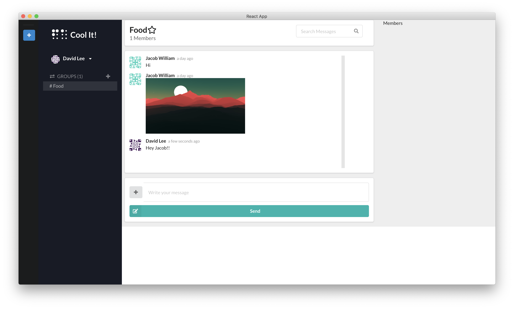

<h1 align="center">
</h1>

# Cool It!

> Why not? Real time chat for developers. 

---

## Screenshot
<h1 align="center">
</h1>

---

## Installation

- Go to releases
- Download the build that's compatible with your operation system.

---

## FAQ

- **Having problem setting up?**
    - No problem! contact me on `amjedcha@gmail.com` or open an issue.

---

## License

- **[MIT license](http://opensource.org/licenses/mit-license.php)**